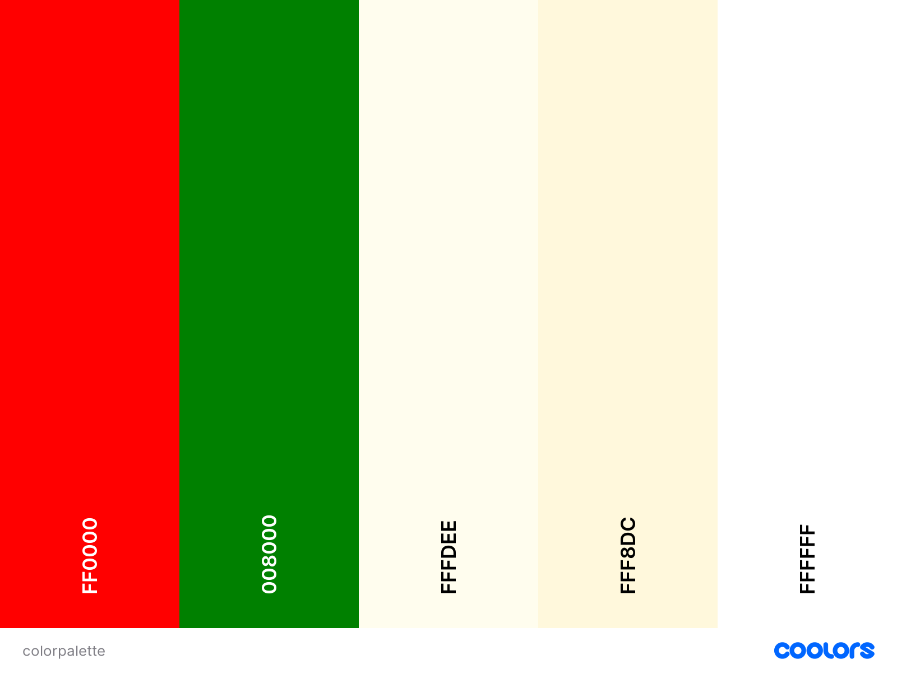

# PIZZERIA PALERMO

"Welcome to Palermo Pizzeria, your go-to destination for authentic Italian-style pizzas in the heart of Montreal. 
This project aims to provide customers with a taste of Italy through a variety of classical, meat, vegetarian, and seafood pizzas. 
I built this website so that the whole world could take part of this wonderful pizzeria.

Add an image of the finished site here. I like to use [amiresponsive](https://ui.dev/amiresponsive) to get an image of my site on all device sizes, and amiresponsive allows you to click links on the page and scroll, so each device can show a different element of your site.

Add a link to the live site here, for Milestone 1 this will be the GitHub Pages Link from when you deployed the site.

GITHUB PAGES

[You can view the GitHub code pages here.]<https://github.com/Jesper941/Pizzeria>

## CONTENTS

- [PIZZERIA PALERMO](#pizzeria-palermo)
  - [CONTENTS](#contents)
  - [User Experience](#user-experience)
    - [User Stories](#user-stories)
      - [Client Goals](#client-goals)
      - [First Time Visitor Goals](#first-time-visitor-goals)
      - [Returning Visitor Goals](#returning-visitor-goals)
      - [Frequent Visitor Goals](#frequent-visitor-goals)
  - [Design](#design)
    - [Colour Scheme](#colour-scheme)
    - [Typography](#typography)
  - [Features](#features)
    - [Home Page](#home-page)
    - [Menu Page](#menu-page)
    - [Contact Page](#contact-page)
    - [Future Implementations](#future-implementations)
    - [Accessibility](#accessibility)
  - [Technologies Used](#technologies-used)
    - [Languages Used](#languages-used)
    - [Local Development](#local-development)
      - [How to Fork](#how-to-fork)
      - [How to Clone](#how-to-clone)
  - [Testing](#testing)
  - [Credits](#credits)
    - [Code Used](#code-used)
    - [Content](#content)
    - [Media](#media)
    - [Acknowledgments](#acknowledgments)

## User Experience

### User Stories

Here are different kinds of user stories.

#### Client Goals

* The client's primary goal is to showcase their authentic Italian-style pizzas and convey their passion for delivering high-quality and delicious pizzas to their customers.
* The client may want to provide an easily accessible and well-organized online menu to help customers explore their wide range of pizza offerings, ingredients, and flavors.
* The website aims to attract more customers to the physical pizzeria by providing essential information, such as location, contact details, and a reservation option.
* To allow visitors to communicate with Palermo Pizzeria with an enquiry or to reserve a table at the restaurant
*  The website's design, color scheme, and content can reflect the pizzeria's brand identity and convey a sense of warmth, tradition, and authenticity.
* To be able to see and do all of the above on any device, whether a mobile phone or a desktop computer.

#### First Time Visitor Goals

* I want to see what pizzas they have.
* I want to see what kind of vegetarian options they have.
* I want to get in touch with the pizzeria about reservations or questions.
* I want to navigate the site with ease.
* I want to find out where the pizzeria is located so that i can visit it.

#### Returning Visitor Goals

* I want to try different pizzas with different toppings.
* I want to see if they have added anything new to their menu.

#### Frequent Visitor Goals

* I want to find the number to the pizzeria easily so i can call and order my favorite pizza right away.
* I want to be able to recommend Palermo Pizzeria to all my friends.

---

## Design

### Colour Scheme

The colour scheme for the website came with inspiration from the colors of the italian flag. The cream colors fit in well with the theme and they kind of came to me right away as i was imagining the completed website in my head. 

### Typography

I used the standard font style for the majority of the site.

For the footer i chose the "Arial" font family, specifically for the text next to the social media links.

Font Awesome was used to make the icons for the social medias in the footer.

---

## Features

The website is built up by 3 pages in total. The home menu that holds some history of the start of Palermo Pizzeria and it's owner Guiseppe Fontana. The menu page where all the pizzas and their respective toppings are showcased. And lasty a contact and find us page where you can book a reservation, ask questions and get directions to the pizzeria.

Each page has the phone number for the pizzeria in it's header.
Each page also has a nav bar that's easily useable.

### Home Page

The home page has a text container where all the history about the restaurant and it's owner is contained.
The page is responsive and adapts after screen size.

### Menu Page

The menu page is built up of four different div blocks that are responsive to the screen size. It starts with 2 menus per row and as the screen size shrinks, it goes down to showing only 1 menu and it stacks in columns instead.
It has four ordered lists, one in each div, with all the different options in them. 
Each list item has a paragraph nested inside them where the toppings are added.
There is a "Back to the top" button at the bottom that is nested inside an anchor with the #top href.

### Contact Page

The contact page consists of two different div blocks with a container nested inside them.
The first container one holds a table with the opening hours and also a form where you can send reservation requests and questions.
The second container holds the iframe with the location of the restaurant.
There is a "Back to the top" button at the bottom that is nested inside an anchor with the #top href.

### Future Implementations

- Adding prices to the pizzas
- Adding images of the pizzas
- Making the home page a bit more welcoming. Add some photos of the restaurant and of Guiseppe.
- Implement a order feature for pickups.
- Create logins with order histories.

---

### Accessibility

I have tried to ensure the site has been made as accessible as possible by:

- Using semantic HTML such as section, header, footer, main, etc.
- Using alt attributes on images where available.
- Using colours that are easy on the eye and fits in well together.

---

## Technologies Used

### Languages Used

I used HTML and CSS to build this website.

### Local Development

Instructions on how to fork and clone the project.

#### How to Fork

1. Log in (or sign up) to Github.
2. Go to the repository for this project, <https://github.com/Jesper941/Pizzeria>
3. Click the Fork button in the top right corner.

#### How to Clone

1. Log in (or sign up) to GitHub.
2. Go to the repository for this project, kera-cudmore/TheQuizArms
3. Click on the code button, select whether you would like to clone with HTTPS, SSH or GitHub CLI and copy the link shown.
4. Open the terminal in your code editor and change the current working directory to the location you want to use for the cloned directory.
5. Type 'git clone' into the terminal and then paste the link you copied in step 3. Press enter.

## Testing

You can find all of the testing done in the [TESTING.md file](TESTING.md)

## Credits

Here i'm gonna list the credits to all the sources that helped me out during this project.

### Code Used

Some general tips and tricks from youtuber Brocode and his video: <https://youtu.be/HGTJBPNC-Gw?si=MoPalcBbt6jw2o88>
For the stroke text i went here for help: <https://css-tricks.com/adding-stroke-to-web-text/>
I took some help from this website when i needed help with styling the pseudo-elements for the links in the nav bar: >https://css-tricks.com/pseudo-class-selectors/>

### Content

I personally wrote all the code for the website. My girlfriend did help me come up with the backstory for the Pizzeria.
Guiseppe is actually her sisters Italian boyfriend who's father had a pizzeria, so it drew inspiration from fiction and real life.

###  Media

Background image in the header: <https://www.11inchpizza.com.au/wp-content/uploads/2019/10/pizza-ingredients-768x513.jpg>
  
###  Acknowledgments

Thanks to my girlfriend for helping me out with the backstory and just general emotional support!
Big thanks to my mentor https://github.com/Jubrillionaire for giving me valuable tips and constructive counseling on what was good and what i need to do better on!

