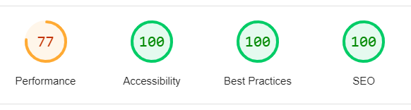
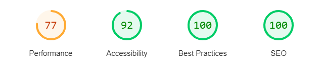
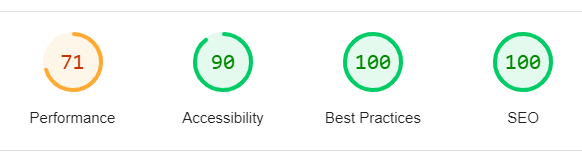

## CONTENTS

- [CONTENTS](#contents)
- [AUTOMATED TESTING](#automated-testing)
  - [W3C Validator](#w3c-validator)
  - [Lighthouse](#)
  - [Full Testing](#full-testing)
- [Bugs](#bugs)
  - [Known Bugs](#known-bugs)
  - [Solved Bugs](#solved-bugs)

Testing was ongoing throughout the entire build. i took help from the Chrome developer tools while building to pinpoint and troubleshoot any issues as i was building the website.

I have gone through each page using google chrome developer tools to ensure that each page is responsive on a variety of different screen sizes and devices.

- - -

## AUTOMATED TESTING

### W3C Validator

[W3C](https://validator.w3.org/) was used to validate the HTML on all pages of the website. It was also used to validate the CSS.

* [Index Page] ( Pass - Checked the "index.html" using https://validator.w3.org/nu/#textarea )
* [Menu Page] ( Pass - Checked the "menus.html" using https://validator.w3.org/nu/#textarea )
* [Index Page] ( Pass - Checked the "findus.html" using https://validator.w3.org/nu/#textarea )
* [Style.css] ( Pass . Checked the "style.css" using https://jigsaw.w3.org/css-validator)

## Lighthouse

My Lighthouse score were really good for accessability. The performance was not so great so i will try to improve on that part.

### LAPTOP RESULTS

HOME PAGE

MENU PAGE

CONTACT PAGE

- - -

### Full Testing

Full testing was performed on the following devices, and additional testing for other devices was carried out using developer tools:

Laptop, Mobile M, Mobile L and Tablet.

Each device tested the site using the following browsers:

Google Chrome on and Windows.

`Index Page`

| Feature | Expected Outcome | Testing Performed | Result | Pass/Fail |
| --- | --- | --- | --- | --- |
| **NAVBAR** |  |  |  |  |
|  |  |  |  |  |
| `Navbar` |
| Home Link | Redirects to home page | Click home link | Redirects to home page | Pass |
| Menu Link | Redirects to menu page | Click menu link | Redirects to home page | Pass |
| Contact Link | Redirect to contact page | Click log in link | Redirected to contact page | Pass |
| `Home Page` |
| No functions that resides on the home page that needs testing
| `Menu Page` |
| Back-To-Top Button | Redirects user to the top of the page | Click button | Redirected to top of the page | Pass |
| `Contact Page` |
| Form - Submission with no information | User prompted to fill in information | clicked submit button with no fields filled out | Form highlighted first empty field | Pass |
|Iframe | 
| Back-To-Top Button | Redirects user to the top of the page | Click button | Redirected to top of the page | Pass |
| `Footer` |
| Footer - Social media links | Opens new tab to the social media site | Clicked each icon | New tabs opened for each site | Pass |
|conditions page | Pass |
|  |  |  |  |  |

## Bugs

### Known Bugs

| Known Bug No | Bug Issue | Plan to Resolve |
| :--- | :--- | :--- |
| 1 |  | :--- |

### Solved Bugs

| Bug No | Bug Issue | How Resolved |
| :--- | :--- | :--- |
| 1 |  | :--- |